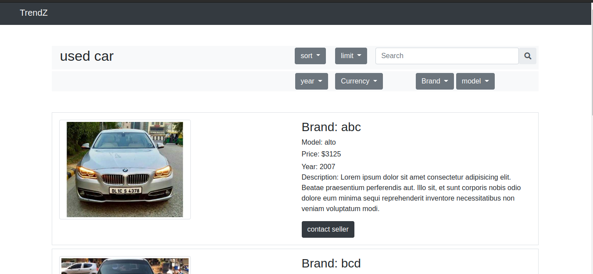
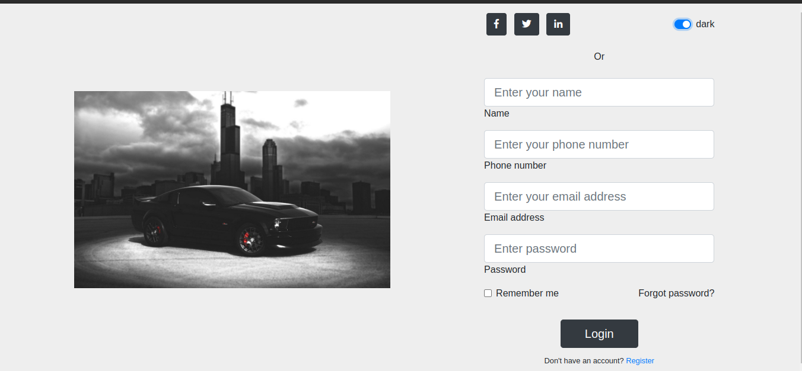
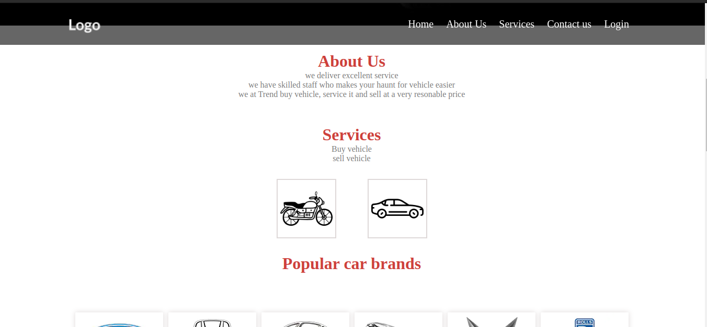
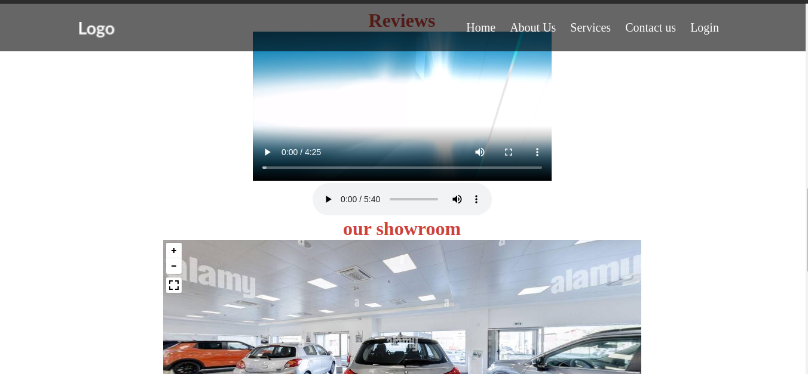

<!DOCTYPE html>
<html lang="en">
<head>
    <meta charset="UTF-8">
    <meta http-equiv="X-UA-Compatible" content="IE=edge">
    <meta name="viewport" content="width=device-width, initial-scale=1.0">
</head>
<body>
    <h1>Description: </h1>
    
This project lets people to add number of covid cases in their region. The Dashboard gives details like number of cases, region, number of death, number of deceased etc.

    <h1>Tools used: </h1>
            <ul>
                <li>Frontend- vanilla css, bootstrap, angular</li>
            </ul>
    <h1>To git hub pages <a href="https://rajesh-ss.github.io/used-Car-Bike-showroom/">Click here</a></h1>
    <h1>Screenshots of the above program: </h1>
</body>
</html>

